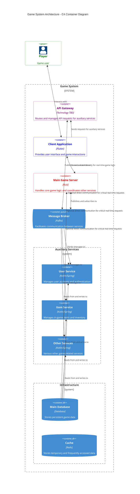

# Modoo RPG

## Introduction
Modoo RPG는 대규모 다중 사용자 온라인 롤플레잉 게임(MMORPG) 시스템입니다. 본 문서는 이 게임 시스템의 전체적인 아키텍처와 핵심 구성 요소를 설명합니다.

## Architecture Diagram

## Components

### Client Application (Flutter)
- 실시간 게임 로직을 위한 메인 게임 서버와의 직접 통신
- 보조 서비스 요청을 위한 API Gateway 활용

### Main Game Server (Rust)
- 핵심 게임 로직 처리 및 실시간 상호작용 관리
- Rust
  - 낮은 지연 시간과 높은 처리량 보장
- Tick-based 시스템
  - 게임 로직이 일정한 간격(tick)으로 실행되어 일관된 게임 경험 제공 
  - 서버와 클라이언트 간의 동기화 용이
- Behavior Tree (bonsai)
  - AI 및 NPC의 복잡한 행동 패턴 구현에 활용
- 동적 공식 평가 (fasteval)
  - 게임 내 공식(데미지 계산 등)을 YAML 파일에 저장
  - 게임 밸런싱 및 조정 용이

### API Gateway
- 클라이언트와 보조 서비스 사이의 중앙 진입점 역할
- 요청 라우팅, 구성, 프로토콜 변환 등을 담당
- 필요시 보조 서비스와의 직접 통신 지원으로 유연성 확보

### Auxiliary Services (Kotlin/Spring)
- 사용자 관리, 아이템 관리 등 특정 도메인 로직을 담당하는 마이크로서비스
- Kotlin과 Spring 프레임워크를 사용하여 빠른 개발과 안정성 확보
- 각 서비스는 독립적으로 배포 및 확장 가능

### Message Broker (Kafka)
- 서비스 간 비동기 통신을 위한 중앙 메시지 브로커
- 이벤트 기반 아키텍처를 지원하여 서비스 간 느슨한 결합 실현
- 높은 처리량과 내구성을 제공하여 대규모 실시간 데이터 처리 지원

### Kafka Streams와 StateStore 활용

- Streams의 StateStore를 활용해 고성능 서비스 구현, RocksDB를 백엔드로 내결함성을 제공

### Infrastructure
- **Main Database**: 영구적인 게임 데이터 저장소로 사용
  - 주로 게임 세션 종료 시 데이터 영속화에 활용
- **Redis Cache**:
  - 세션 관리, 실시간 순위표 등 임시 데이터 저장에 활용
